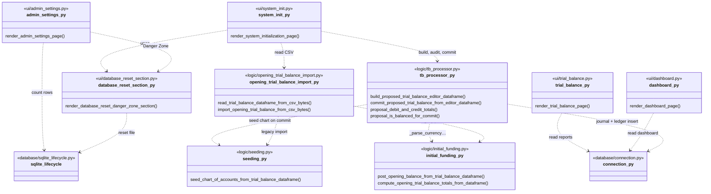
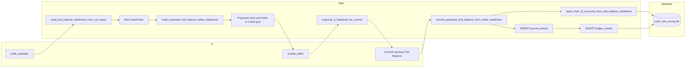

# Moth and Money V5 — UI and logic architecture

Formal overview of how **`/ui`** and **`/logic`** relate, and how Trial Balance bytes move into **`moth_and_money.db`**.

---

## Module dependency (class-style diagram)

Python here is mostly **functions in modules**, not classes. Boxes below stand for **modules**; arrows mean “imports and calls into.”

**Note:** `import_opening_trial_balance_from_csv_bytes` is a **legacy** path (CLI / older callers). System Initialization uses **`tb_processor.commit_proposed_trial_balance_from_editor_dataframe`** after `st.data_editor`.

---

## Data flow: upload → SQLite (System Initialization)

---

## Chambers (constitutional)

| Layer | Role |
|--------|------|
| **`/ui`** | Streamlit layout, `st.file_uploader`, `st.data_editor`, buttons, captions. |
| **`/logic`** | CSV normalization (when needed), keyword mapping, `Decimal` totals, orchestration of chart + opening entry. |
| **`/database`** | Engine, sessions, schema bootstrap, SQLite file reset, raw SQL for journal/ledger in `tb_processor` commit path. |

---

*Generated for Moth and Money V5; update this file when modules or import paths change.*
